# 逻辑回归案例学习笔记
## 1 逻辑回归原理
**逻辑回归定义：**  

逻辑回归又称 logistic 回归分析（对数几率回归分析），是一种广义的线性回归分析模型，常用于数据挖掘，疾病自动诊断，经济预测等领域。

逻辑回归虽然名称中带有回归二字，但是实际上它是一个分类算法。它是在线性回归的基础上上，加入了sigmoid函数。
将线性回归的结果输入sigmoid函数中，并设置一个阈值，如果输出大于阈值，则类别为1；如果输出小于阈值，则类别为-1.

**优点：**  
1. 逻辑回归适用于二分类问题  
2. 训练速度快  
3. 由于经过了sigmoid函数的映射，因此结果的鲁棒性较好  

**缺点：**  
1. 容易欠拟合  
2. 特征空间很大时效果不好  
3. 由于sigmoid函数的特性，接近0/1的两侧概率变化较平缓，中间概率敏感，波动较大；导致很多区间特征变量的变化对目标概率的影响没有区分度，无法确定临界值。  

## 2 adult_rich 案例
### 2.1 案例背景

美国是当前世界上最强大的国家，其国民平均收入远高于世界人均水平。根据美国商务部发布的统计调查报告显示，截止2018年，美国人均收入已达到60555美元/每年。
是当之无愧的第一大经济体，美国拥有这个世界上最庞大的中产阶级群体，拥有极大的社会财富，并占据了世界上最多的中高端就业岗位。

与此同时，美国人的收入与消费、犯罪率、城市发展息息相关。目前，美国过大的贫富差距和低收入人口影响着整个美国社会的稳定。
为此，美国联邦政府、州政府、地方政府采取了一系列的措施，如提供就业岗位、社会培训、社会救助等等，但就实际效果而言，并没有改善整个社会的现状。

美国社会的问题，也会成为中国、欧盟等及其他大型经济体的问题，特别是中国政府也需要思考如何解决 14 亿中国人的就业、收入、消费、教育等问题。
这对于一个世界上人口最多、体量最终的国家而言，是一个无比艰巨的任务。如果，能够借鉴美国发展的经验，或许能够对摆脱贫困，促进人民富裕提供参考。

**思考：**  
1. 如何使得国家、人民摆脱贫困？如何有效的帮助低收入人群？  
2. 如何扩大中产阶级与高收入阶级群体的占比？  
3. 哪些是中高收入人群，他们具备了哪些特征？
4. 能提供高收入的工作岗位是哪些？

从1994年开始，美国政府通过人口普查等措施，采集了大量的美国公民的收入数据，可以用于判断居民收入是否是中高收入人群。
其中，包括年龄，工种，学历，职业，人种等重要信息，以及作为类标号的是否富裕。

根据采集的这些人群特征，能否判断某个人是否是高收入群体？

    注：1994年，美国的人均收入为23.3K USD，人均收入中位数为 15.9K USD。家庭年收入超过50K的人群，即可认为是中美国中高收入的群体。

**特征描述:**

    这个数据集是来做 UCI 的一个数据集，多次出现在 Kaggle 的竞赛中，我瞎编了背景，让着案例变得更加有趣。

|      |feature_name| feature_type | structure | describe    |
| ---- | :----:     | :----:       | :----:    | :----:      |
| 0 | age           | continues    | int       | 年龄         |
| 1 | workclass     | discrete     | norminal  | 企业类别     |
| 2 | fnlwgt        | discrete     | norminal  | 序号，无意义 |
| 3 | education     | discrete     | norminal  | 最高学历     |
| 4 | education_num | continues    | int       | 受教育年限   |
| 5 | marital_status| discrete     | norminal  | 婚姻状况     |
| 6 | occupation    | discrete     | norminal  | 工作类型     |
| 7 | relationship  | discrete     | norminal  | 家庭关系     |
| 8 | race          | discrete     | norminal  | 肤色         |
| 9 | sex           | discrete     | norminal  | 性别         |
|10 | capital_gain  | continues    | float     | 投资收入     |
|11 | capital_loss  | continues    | float     | 投资损失     |
|12 | hours_per_week| continues    | float     | 每周工作时长  |
|13 | native_country| discrete     | norminal  | 族裔         |
|14 | rich          | norminal     | int       | 是否超过50K  |

### 2.2 案例实验

#### 2.2.1 数据预处理
    
    去除空值:  
    print(data.isnull().sum()) # 通过分析可以看出，数据集无缺失值
    age                  0  
    workclass         1836  
    fnlwgt               0  
    education            0  
    education_num        0  
    marital_status       0  
    occupation        1843  
    relationship         0  
    race                 0  
    sex                  0  
    capital_gain         0  
    capital_loss         0  
    hours_per_week       0  
    native_country     583  
    rich                 0  
    
    workclass 空值有1836个，occupation 有1843个，native_country 有583个,共计2399个空值,缺失样本条数占总数据样本8%左右
    存在空值的列是: workclass、occupation、native_country, 这三列都是标称类属性，且与其他列的关联性较弱，不好做关联插值
    这里我们直接将其去除

    查看类标号分布：
    print('poor: ' + str(data[data.rich ==0].index.size))
    print('rich: ' + str(data[data.rich ==1].index.size))
    poor: 24720
    rich: 7841

#### 2.2.2 特征工程

**连续特征:**

    age 和 rich 的关系
    可以看出rich的人群和poor的人群在年龄阶段上存在比较明细的差异
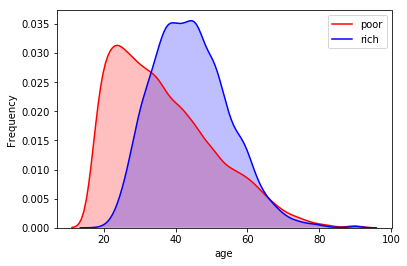

    hours_per_week 和 rich 的关系
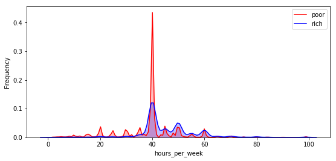

    capital_gain 和 rich 的关系
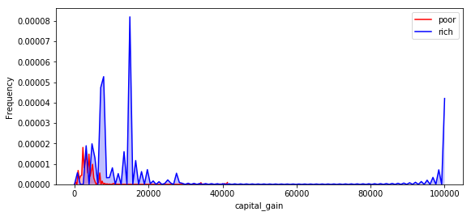

    capital_loss 和 rich 的关系
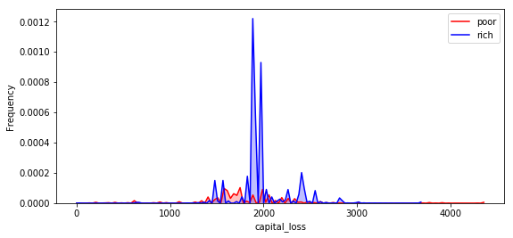

    education_num 和 rich 的关系
    可以看出，随着受教育年限的增加，富裕人群的比率也随之增加
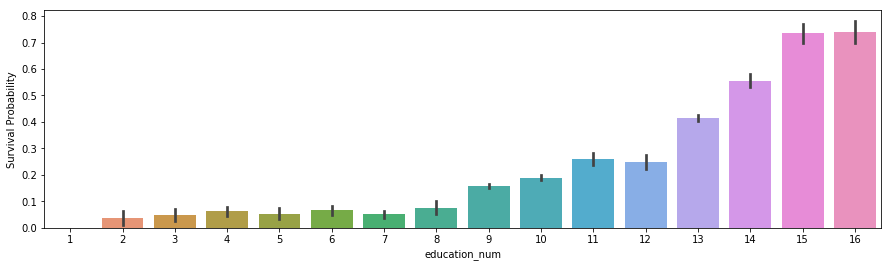

**离散特征:**

    workclass 和 rich 的关系
    根据不同workclass的情况，我这里将without-pay和never-worked归为一类，将state-gov、self-emp-not-inc、Local-gov归为一类
    然后对几类的特征做哑变量处理
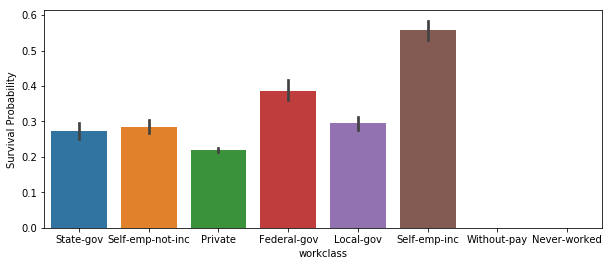
    
    education 和 rich 的关系
    通workclass的处理方式类似，将概率接近的几种学历类型归为一类，然后按照由小到大进行编码，暂不做哑变量处理
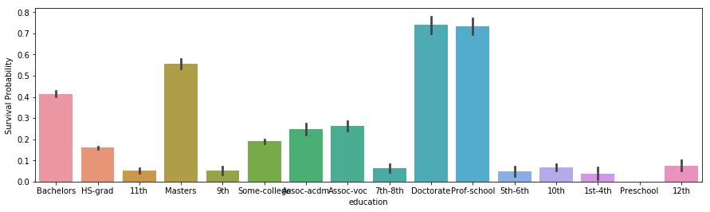

    利用皮尔逊相关系数来看一下 education 编码过后，和education_num之间的关联性
    由于 education 和 education_num 的相关性极高，存在特征冗余，我们使用 education_num，并将 education 去除
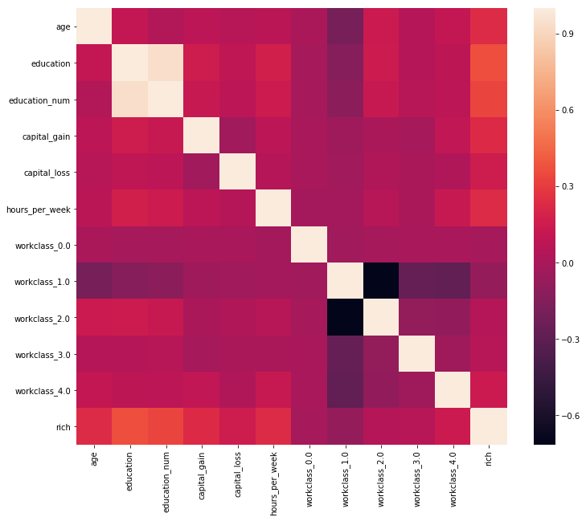

    marital_status 和 rich 的关系
    这里也将marital_status分为了5类，然后做哑变量处理
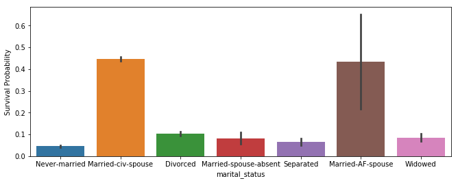

    occupation 和 rich 的关系
    按照概率进行分箱，然后做哑变量
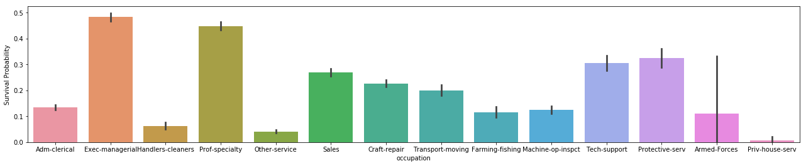

    relationship 和 rich 的关系
    按照概率进行分箱，然后做哑变量
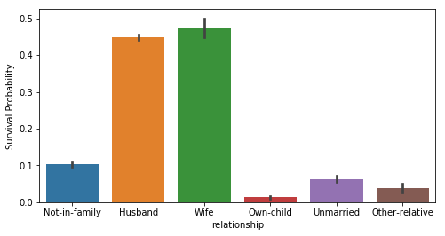

    race 和 rich 的关系
    按照概率进行分箱，然后做哑变量，这里将亚裔和白人归位了一类，将印第安裔、黑人归为了一类，others为一类
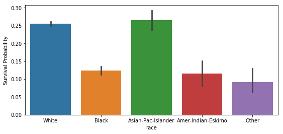

    sex 和 rich 的关系
    可以看出性别和富裕程度有明细差别，美国职场性别歧视的严重？
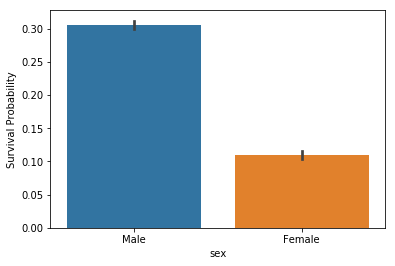

    native_country 和 rich 的关系
    由于 native_country 中的国家裔族太多，然后不同裔族的富裕人群的比率差别比较明显
    我这里按照每增加5%富裕人群的情况进行分箱，最后分为10类
    （吐槽一下，印度裔是最高的，超过了45%，看来印度精英真的都移民了）
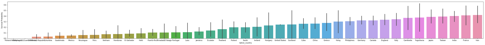
    
**特征相关性:**

    所有特征和类标号的相关性分析
    通过特征矩阵可以很明显的看出，relationship_4 和 marital_status_4 明显正相关，再根据其含义分箱，marital_status_4 中有两个标签组成，其
    含义是指 已婚配的状态，然后再看 relationship_4 中，其含义是 丈夫和妻子，很明显它门一一对应，因此存在特征冗余，我们选择保留relationship_4
    去除 marital_status_4
    # sex、race、workclass出现了较大的负相关性，这是由于做了哑变量后出现了，可以忽视
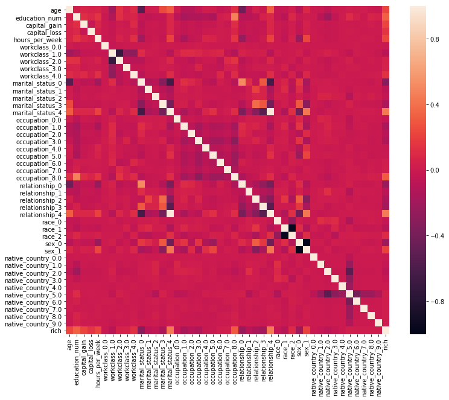

**过采样:**
    
    由于样本中rich的人群只有7841个，而非rich的人群有24720个，存在很明显的差别。因此，这里我用sklearn库里的ADASYN去做过采样
    

**数据归一化/标准化:**

    由于连续特征的差异实在是比较大，特别是capital_loss和capital_gain看起来比较像正态分布，这里对样本特征进行特征变换
    实际上，对age取log之后再做特征变换较好；对教学年限的话，通过归一化缩放到0-1空间较好

#### 2.2.3 模型训练与评估

    这里使用了逻辑回归对模型进行训练，最后准确率在85%左右，f1值也在86%左右
    如果使用随机森林、Adaboost等集成算法，应该还能提升一点准确性，但是效果也不是很明显，而且比逻辑回归复杂太多

#### 2.2.4 结果可视化 
    
    最后，画了一下模型的ROC曲线，可以看到在FP取值0.2的时候，TP就达到0.85左右，在FP取值0.4时，TP达到了0.98以上
    ROC曲线的面积已经达到了0.93，这个模型已经很不错了
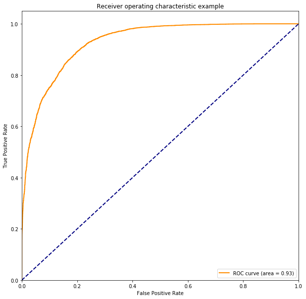

## 3 总结

    逻辑回归是一个分类算法！
    实际上很多线性分类器都是在逻辑回归上衍生出来的，学习好逻辑回归的属性模型很重要。
    
    在学习逻辑回归中会接触到梯度下降法，这是最优化算法中的一种。
    参数最优化的问题是一个很大的门类，里面的知识点很多，前期可以先学一点最基础的最优化方法（梯度下降法、最小二乘法、SMO）即可。
