* [随机森林案例学习笔记](https://github.com/sfonly/Machine_Learning/tree/master/Examples/Classification/RandomForest)
  * [随机森林原理](https://github.com/sfonly/Machine_Learning/tree/master/Examples/Classification/RandomForest#1-随机森林原理)
  * [Titanic案例](https://github.com/sfonly/Machine_Learning/tree/master/Examples/Classification/RandomForest#2-Titanic案例)
    * [案例背景](https://github.com/sfonly/Machine_Learning/tree/master/Examples/Classification/RandomForest#21-案例背景)
    * [案例实验](https://github.com/sfonly/Machine_Learning/tree/master/Examples/Classification/RandomForest#22-案例实验)
      * [数据预处理](https://github.com/sfonly/Machine_Learning/tree/master/Examples/Classification/RandomForest#221-数据预处理)
      * [特征工程](https://github.com/sfonly/Machine_Learning/tree/master/Examples/Classification/RandomForest#222-特征工程)
      * [模型训练与评估](https://github.com/sfonly/Machine_Learning/tree/master/Examples/Classification/RandomForest#223-模型训练与评估)
      * [结果可视化](https://github.com/sfonly/Machine_Learning/tree/master/Examples/Classification/RandomForest#224-结果可视化)
  * [总结](https://github.com/sfonly/Machine_Learning/tree/master/Examples/Classification/RandomForest#3-总结)


# 随机森林案例学习笔记
## 1 随机森林原理
**随机森林定义：**  
[随机森林-维基百科](https://zh.wikipedia.org/wiki/随机森林)

**优点：**  

1. 在绝大部分分类问题中，都能产生高精确度的分类器
2. 可以处理维度极高的数据
3. 可以在判断类别的同时，评估特征的重要性
4. 在建造森林时，可以在内部进行无偏估计
5. 对缺失值有较高的抗性
6. 对于类标号不平衡的数据集，它能够平衡误差
7. 随机森林在集成学习中，学习速度较快
8. 随机森林可以用于分类和回归

**缺点：**  

1. 如果训练数据存在较大噪声，随机森林可能会产生过拟合
2. 相对于决策树而言，随机森林计算成本高，且不太好解释
3. 当随机森林中的树较多时，训练时间较长
4. 不太好确定一个随机森林中有多少树合适

## 2 Titanic案例
### 2.1 案例背景

    Titanic 是历史上最著名的沉船之一。在 1997年，被詹姆斯卡梅隆搬上了银屏而闻名世界。
    Titanic 是当时世界上体积最庞大、内部设施最豪华的客运轮船，有“永不沉没”的美誉。
    然而，1912年4月15日，Titanic 在首次航行期间，撞上冰山后沉没，2224名乘客和机组人员中有 1502人遇难。
    泰坦尼克号沉没事故为和平时期死伤人数最为惨重的一次海难，其残骸直至 1985年才被再度发现。

    这场灾难导致生命损失的原最重要因之一，就是没有足够的救生艇，提供给乘客和机组人员。
    虽然，幸存者或多或少有一定的运气因素，但其中部分人比其他人更有可能生存，比如妇女，儿童和上层阶级的乘客。

    我们想通过机器学习的方式，通过分析乘客的特征，来预测哪些乘客更有可能幸存，并且找到影响其幸存的主要因素？

**数据集描述:**

|   |  feature_name  | feature_type | structure | describe             |
| - | :----:         | :----:       | :----:    | :----:               |
| 0 | PassengerID    | continues    | int       | 乘客ID               |
| 1 | Survival       | discrete     | int       | 是否存活              |
| 2 | Pclass         | continues    | norminal  | 船舱登记              |
| 3 | Name           | discrete     | norminal  | 名                   |
| 4 | FirstName      | discrete     | norminal  | 姓                   |
| 5 | Sex            | discrete     | norminal  | 性别                 |
| 6 | Age            | continues    | int       | 年龄                 |
| 7 | SibSp          | continues    | int       | 船上兄弟姐妹/配偶的数量|
| 8 | Parch          | discrete     | norminal  | 船上父母子女的数量     |
| 9 | Ticket         | discrete     | norminal  | 船票名称              |
|10 | Fare           | continues    | float     | 船票的价格            |
|11 | Cabin          | discrete     | norminal  | 客舱号码              |
|12 | Embarked       | discrete     | norminal  | 上传港口              |


**类标号描述:**

``` python
print('Survived:', dataSet[dataSet['Survived'] == 1].shape[0])
print('Not Survived:',dataSet[dataSet['Survived'] == 0].shape[0])
Survived: 494
Not Survived: 815
```

    对类标号进行分析，在1309个样本中，有494个存活，有815个死亡
    存活和死亡的人数的差异较大

### 2.2 案例实验

#### 2.2.1 数据预处理

**数据集整体描述分析:**

    通过对数据集进行分析可知，数据集共1309条，包含11个特征和1个类标号
    其中 Age、Cabin、Embarked 这三个特征存在缺失值

``` python
print(dataSet.info())
print(dataSet.isnull().sum())

RangeIndex: 1309 entries, 0 to 1308
Data columns (total 13 columns):
PassengerId    1309 non-null int64
Survived       1309 non-null int64
Pclass         1309 non-null int64
Name           1309 non-null object
FamilyName     1309 non-null object
Sex            1309 non-null object
Age            1046 non-null float64
SibSp          1309 non-null int64
Parch          1309 non-null int64
Ticket         1309 non-null object
Fare           1308 non-null float64
Cabin          295 non-null object
Embarked       1307 non-null object
dtypes: float64(2), int64(5), object(6)
memory usage: 133.0+ KB
None
PassengerId       0
Survived          0
Pclass            0
Name              0
FamilyName        0
Sex               0
Age             263
SibSp             0
Parch             0
Ticket            0
Fare              1
Cabin          1014
Embarked          2
dtype: int64
```

**去除异常值:**  

    通过Age、SibSp、Parch、Fare这四个连续特征，寻找异常值
    寻找存在 3 个异常特征的行，drop掉，并打印改行的这四个特征

``` python
def handle_outliers(data, continues_features, k = 1):
    '''
    处理异常值
    打印要删除的列，并返回一个 drop 过后的对象
    Parameters:
        data:                   数据集
        continues_features:     需要判断存在异常值的连续特征
        n:                      存在 n 个异常特征, 即为异常值
    Return：
        data：                   去除异常值后的数据集
    '''
    multiple_outliers = find_outliers(dataSet, continues_features,k)    

    for row in multiple_outliers:           
        print('line: %s, Age: %s, SibSp: %s, Parch: %s, Fare: %s' \
              %(row,data['Age'][row],data['SibSp'][row],data['Parch'][row],data['Fare'][row]))

    data = data.drop(multiple_outliers, axis = 0).reset_index(drop=True)
    return data
```
``` python
dataSet = handle_outliers(dataSet, continues_features, k = 3)

line: 27, Age: 19.0, SibSp: 3, Parch: 2, Fare: 263.0
line: 88, Age: 23.0, SibSp: 3, Parch: 2, Fare: 263.0
line: 159, Age: nan, SibSp: 8, Parch: 2, Fare: 69.55
line: 180, Age: nan, SibSp: 8, Parch: 2, Fare: 69.55
line: 201, Age: nan, SibSp: 8, Parch: 2, Fare: 69.55
line: 324, Age: nan, SibSp: 8, Parch: 2, Fare: 69.55
line: 341, Age: 24.0, SibSp: 3, Parch: 2, Fare: 263.0
line: 792, Age: nan, SibSp: 8, Parch: 2, Fare: 69.55
line: 846, Age: nan, SibSp: 8, Parch: 2, Fare: 69.55
line: 863, Age: nan, SibSp: 8, Parch: 2, Fare: 69.55
line: 944, Age: 28.0, SibSp: 3, Parch: 2, Fare: 263.0
line: 1079, Age: nan, SibSp: 8, Parch: 2, Fare: 69.55
line: 1251, Age: 14.5, SibSp: 8, Parch: 2, Fare: 69.55
```

#### 2.2.2 特征工程

**特征相关性分析:**

    对数据集进行初步的特征相关性分析，这些特征的相关性在 (-0.56, 0.34)之间，不存在完全相似的特征

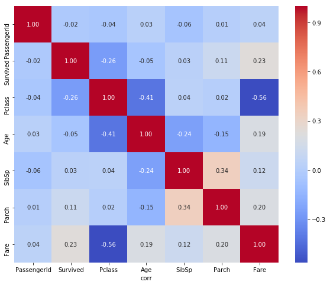
    
**特征分析:**

    性别与生存率的关系如下
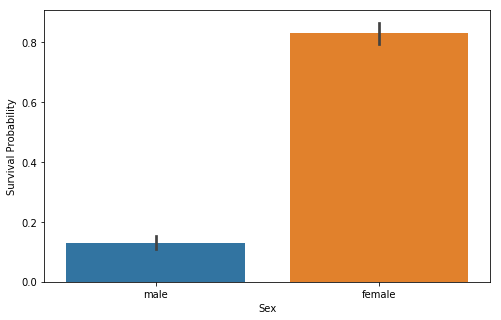

    船上兄弟姐妹/配偶的数量和生存率的关系如下
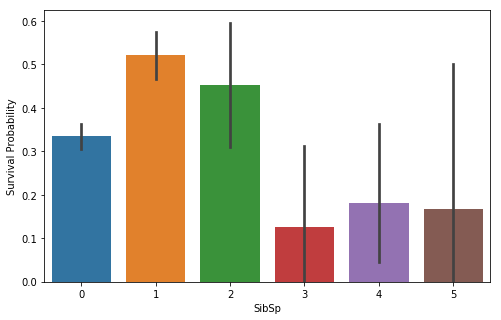

    船上父母/子女的数量和生存率的关系如下
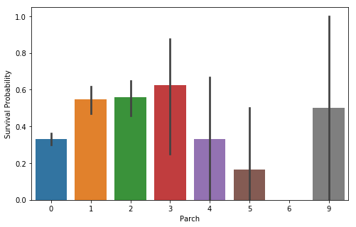

    船舱等级和生存率的关系如下
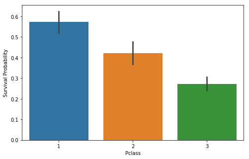

    船票的价格和生存率的关系如下
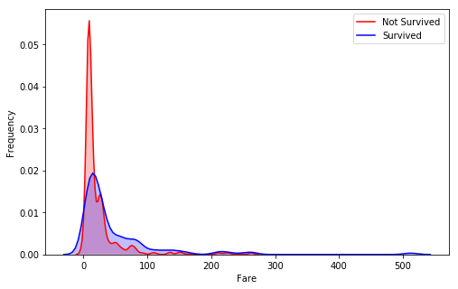

    由于该特征的区间较大，因此对该特征进行离散化，并进行log变换
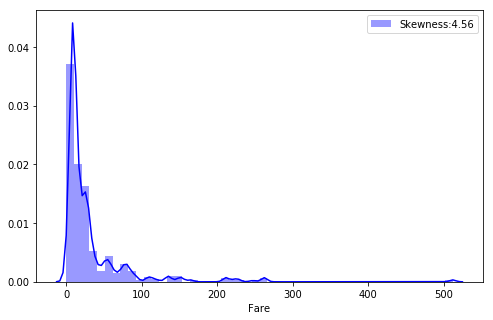

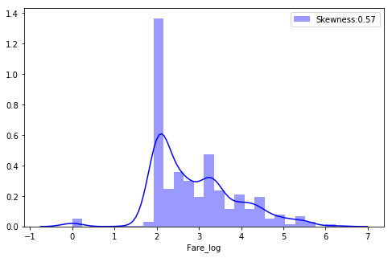

    登船港口和生存率的关系如下
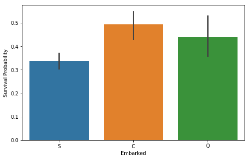

    由于船上的姓名极为复杂，因此这里提取了姓氏中的title进行分析，可以认为title是人身份等级的体现
    部分title的含义如下：
``` python
# Mr.= mister，先生
# Mrs.= mistress，太太/夫人
# Miss 复数为misses，对未婚妇女用
# Ms.或Mz 美国近来用来称呼婚姻状态不明的妇女
# Mme Madame简写是Mme. 复数是mesdames(简写是Mme)
# Mlle 小姐
# Lady 女士，指成年女子，年长者认为这样说比较礼貌
# Dona 是西班牙语对女子的称谓，相当于英语的 Lady
# Master 佣人对未成年男少主人的称呼,相当于汉语的少爷
# Mr. Mister的略字,相当于汉语中的'先生',是对男性一般的称呼,区别于有头衔的人们,如 Doctor, Professor,Colonel等
# Don <西>（置于男士名字前的尊称）先生，堂
# jonkheer 最低的贵族头衔
# Sir 贵族头衔
# Rev.= reverend 用于基督教的牧师
# Dr.= doctor 医生/博士
# Capt 船长
# Colonel 上校
# major 意思有少校人意思
# theCountess 女伯爵
```
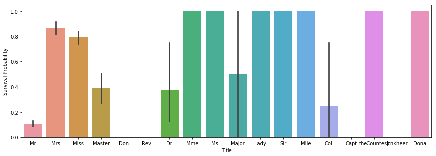

    通过对不同 title 的分析，可以发现其生存率差别极大
    可以看出 Mrs女性的生存率能够达到80%以上，贵族男性的生存率也较高
    因此，根据其含义与生存率，可以将其归并为五类具有较相似特征的人群

``` python
# 第一类： 'Mr', 'Don' 普通男性
# 第二类： 'Mrs','Miss','Mme','Ms','Lady','Dona','Mlle','theCountess'  女性
# 第三类： 'Major','Col','Dr' 军官和医生
# 第四类： 'Sir','Master','Jonkheer'  贵族男性
# 第五类： 'Rev','Capt'  基本不可能幸存的职业
```
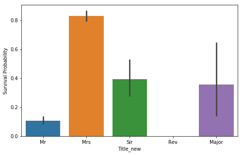

    年龄与生存率之间的关系如下
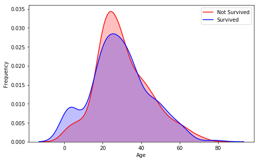

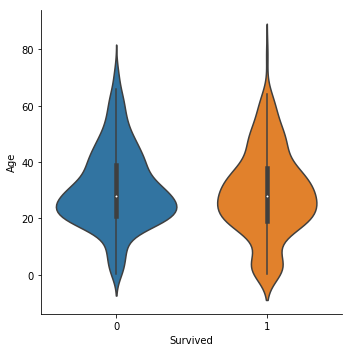

``` python
def preprocesing_Age(dataSet):
    '''
    根据另外几种连续特征，填充 Age
    Parameters:
        dataSet:       数据集
    '''
    index_NaN_age = list(dataSet['Age'][dataSet['Age'].isnull()].index)
    for i in index_NaN_age:
        age_med = dataSet['Age'].median()
        age_pred = dataSet['Age'][((dataSet['SibSp'] == dataSet.iloc[i]['SibSp']) &
                          (dataSet['Parch'] == dataSet.iloc[i]['Parch']) &
                          (dataSet['Pclass'] == dataSet.iloc[i]['Pclass'])
                          )].median()
        if not np.isnan(age_pred):
            dataSet['Age'].iloc[i] = age_pred
        else:
            dataSet['Age'].iloc[i] = age_med
```

    由于年龄这个特征存在缺失值，通过相似性和中位数进行插值后，年龄与生存率的关系如下

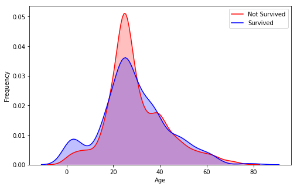

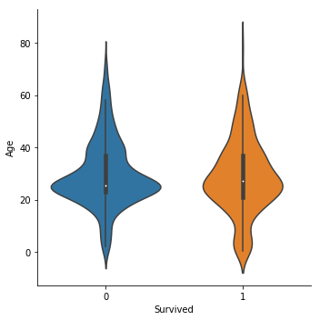

    从 Ticket 中提取中间英文字母的含义
    Ticket 与生存率的关系如下
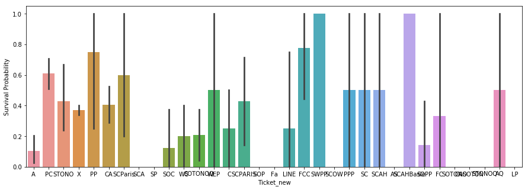

**数据标准化:**

    该数据集的分布区间较小，模型是随机森林
    数据标准化过程不是特别必要

**对特征进行哑变量处理:**

    分别对Title、Ticket、Embarked、Pclass进行哑变量处理

#### 2.2.3 模型训练与评估

**利用网格参数和十择法寻找最优化参数:**  

``` python
# 设置随机森林模型参数网格
rf_param_grid = {'max_depth' : [None],
                  'max_features' : [4, 5, 6, 7, 8],
                  'min_samples_split' : [2, 3, 4],
                  'min_samples_leaf' : [2, 3, 4],
                  'bootstrap' : [False],
                  'n_estimators' : [70, 80, 90, 100, 110],
                  'criterion': ['gini']}

def Kfold_RF(X_train, X_test, y_train, y_test, param_grid, k = 10):
    '''
    采用十择法和参数自动寻优(网格搜索)找到一个近似的优化参数
    Parameters:
        X_train, X_test:        数据集
        y_train, y_test：       特征
        param_grid：            参数网格 
        k：                     十择法默认为 10
    '''
    RFC = RandomForestClassifier()
    kfold = KFold(n_splits = k)
    gsRFC = GridSearchCV(RFC, param_grid = param_grid, cv= kfold, scoring='accuracy', n_jobs= 1, verbose = 1)
    gsRFC.fit(X_train,y_train)
    
    print('----------------------------------------')
    print('best_estimator_: ', gsRFC.best_estimator_)
    print('----------------------------------------')
    print('best_params_: ', gsRFC.best_params_)
    print('----------------------------------------')
    print('best_score_: ', gsRFC.best_score_ )
    print('----------------------------------------')
```

``` python
----------------------------------------
best_estimator_:  RandomForestClassifier(bootstrap=False, class_weight=None, criterion='gini',
            max_depth=None, max_features=5, max_leaf_nodes=None,
            min_impurity_decrease=0.0, min_impurity_split=None,
            min_samples_leaf=4, min_samples_split=3,
            min_weight_fraction_leaf=0.0, n_estimators=70,  n_jobs=None,
            oob_score=False, random_state=None, verbose=0,
            warm_start=False)
----------------------------------------
best_params_:  {'bootstrap': False, 'criterion': 'gini', 'max_depth': None, 'max_features': 5, 'min_samples_leaf': 4, 'min_samples_split': 3, 'n_estimators': 70}
----------------------------------------
best_score_:  0.8743109151047409
----------------------------------------
```

    由于随机森林随机因子的原因，每次建立的模型不一定完全相同
    最后，通过网格寻优得出的最优参数也会有变动
    可以看出，网格法得到的最优参数的准确率为 87.43%

**随机森林建模:**  
``` python
# 找出最优化的随机森林参数
rfc_new = RandomForestClassifier(bootstrap=False, class_weight=None, criterion='gini',
            max_depth=None, max_features=7, max_leaf_nodes=None,
            min_impurity_decrease=0.0, min_impurity_split=None,
            min_samples_leaf=3, min_samples_split=2,
            min_weight_fraction_leaf=0.0, n_estimators=80, n_jobs=None,
            oob_score=False, random_state=None, verbose=0,
            warm_start=False)
rfc_new.fit(X_train,y_train)
print('rfc_new.score(train):', rfc_new.score(X_train,y_train))
print('rfc_new.score(test):', rfc_new.score(X_test,y_test))

rfc_new.score(train): 0.8930540242557883
rfc_new.score(test): 0.8534704370179949
```

    在十择法的基础上，对模型的参数微调后，进行随机森林的训练
    最后模型的在训练集上的准确率为 89.3% 左右，在测试集上的准确率为 85.35% 左右

#### 2.2.4 结果可视化 

**学习曲线:**  
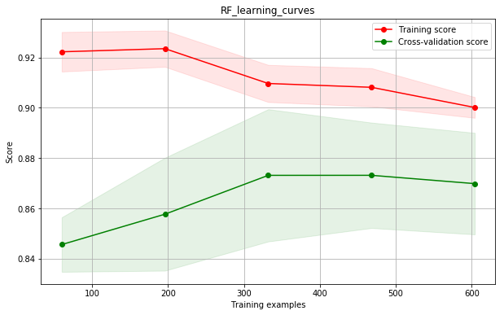

    模型的学习曲线如上图所示
    红线和该区域为训练集的准确度
    绿线和区域为十择法中测试集的准确度
    最终二者趋于收敛，并且差距较小（0.02左右）

**特征重要性排名:**  
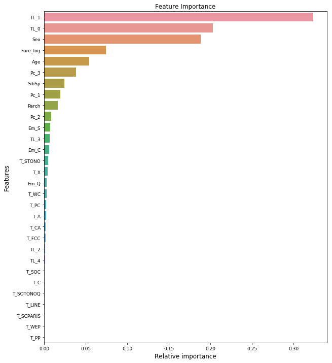  
   
    这里只列出了前30个最重要的特征
    可以看出TL_1,TL_0,Sex是三个最重要的特征
    TL_1是 Mr 普通男性, TL_2 是 Mrs 女性, Sex 是性别
    因此，最重要的特征就是男女的差别

## 3 总结

    随机森林是非常优秀的集成算法，准确率高、泛用性强
    在建模的同时，还可以判断特征的重要性
    因此，随机森林也可以用在特征选择中，从海量的特征中筛选出重要的特征供后续训练使用

    随机森林的基础树模型，一般采用CART，因此，随机森林也可以用于回归分析
    对于随机森林的参数调整，一般只需要修改树的数量，因此，随机森林的训练过程也是比较简单的

    随机森林有着非常多的优点，在实际生产过程中，也是应用非常广泛的算法之一
