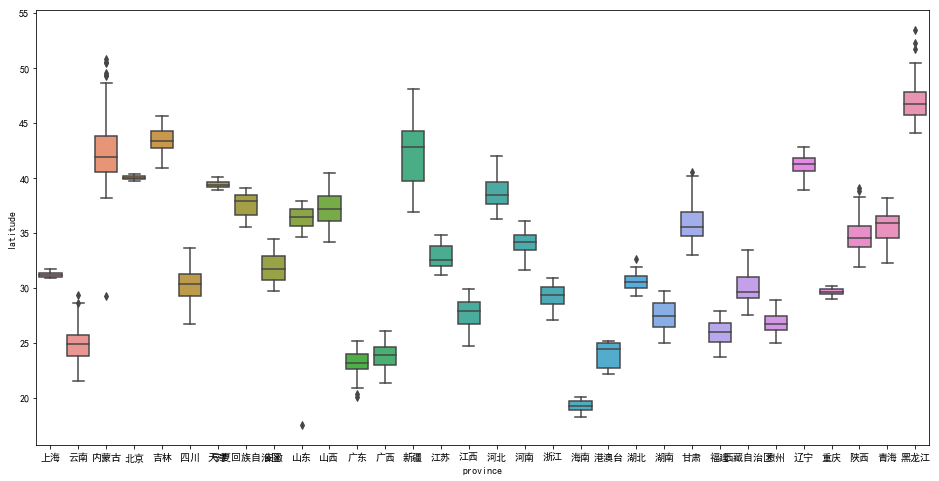
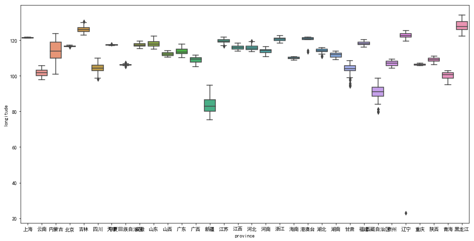
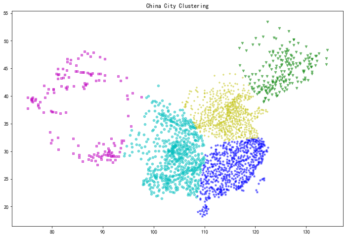

* [K-Means案例学习笔记](https://github.com/sfonly/Machine_Learning/tree/master/Examples/Classification/KMeans)
  * [K-Means原理](https://github.com/sfonly/Machine_Learning/tree/master/Examples/Classification/KMeans#1-K-Means原理)
  * [HeartDisease案例](https://github.com/sfonly/Machine_Learning/tree/master/Examples/Classification/KMeans#2-city案例)
    * [案例背景](https://github.com/sfonly/Machine_Learning/tree/master/Examples/Classification/KMeans#21-案例背景)
    * [案例实验](https://github.com/sfonly/Machine_Learning/tree/master/Examples/Classification/KMeans#22-案例实验)
      * [数据预处理](https://github.com/sfonly/Machine_Learning/tree/master/Examples/Classification/KMeans#221-数据预处理)
      * [特征工程](https://github.com/sfonly/Machine_Learning/tree/master/Examples/Classification/KMeans#222-特征工程)
      * [模型训练与评估](https://github.com/sfonly/Machine_Learning/tree/master/Examples/Classification/KMeans#223-模型训练与评估)
      * [结果可视化](https://github.com/sfonly/Machine_Learning/tree/master/Examples/Classification/KMeans#224-结果可视化)
  * [总结](https://github.com/sfonly/Machine_Learning/tree/master/Examples/Classification/KMeans#3-总结)


# K-Means案例学习笔记
## 1 K-Means原理
**K-Means定义：**  
[K-Means-维基百科](https://zh.wikipedia.org/wiki/K-平均算法)

**优点：**  
1. 原理比较简单，容易实现
2. 聚类效果较好
3. 算法的可解释性较强
4. 调节参数只有簇的个数

**缺点：**  
1. K值的选取不容易确定
2. 对于不凸、不圆的数据集较难收敛
3. 对噪音和异常点非常敏感
4. 采用迭代算法，最后的结果是局部最优解
5. 如果隐含层的数据不平衡，则最后的聚类效果不佳

## 2 city案例
### 2.1 案例背景

    中国是世界上人口最多的国家，也拥有世界上最多的城市，散布在960万平方公里的国土上。
    
    根据《中华人民共和国行政区划简册·2017》统计
    我国总共有 23个省，5个自治区，4个直辖市，2个特别行政区；
    共有 661个市，包括直辖市4个，地级市283个，县级市374个。

    这些城市是如何分布的？有没有什么特殊之处？
    为此，我们采集了中国城市的空间坐标，并且根据省分进行了整理。
    希望能够通过聚类发现中国城市分布的规律

**数据集描述:**

|      |feature_name | feature_type | structure | describe     |
| ---- | :----:      | :----:       | :----:    | :----:       |
| 0 | province       | norminal     | norminal  | 省分         |
| 1 | city           | norminal     | norminal  | 城市         |
| 2 | longitude      | continues    | float     | 经度         |
| 3 | latitudee      | continues    | float     | 纬度         |

**类别描述:**
``` python
         longitude     latitude
count  2255.000000  2255.000000
mean    111.082288    32.853517
std       9.784642     6.577709
min      22.970000    17.490000
25%     106.220000    27.730000
50%     112.840000    32.390000
75%     117.220000    37.360000
max     134.150000    53.480000
<class 'pandas.core.frame.DataFrame'>
RangeIndex: 2255 entries, 0 to 2254

Data columns (total 4 columns):
province     2255 non-null object
city         2255 non-null object
longitude    2255 non-null float64
latitude     2255 non-null float64
dtypes: float64(2), object(2)
memory usage: 70.5+ KB
None
```
### 2.2 案例实验

#### 2.2.1 数据预处理
    
**去除重复值:**

    由于数据集存在完全重复的记录
    因此，先对数据集进行去重操作

``` python
data = dataframe.drop_duplicates(keep='first').reset_index(drop=True)
```

**去除空值:**

    本数据集无空缺值

#### 2.2.2 特征工程


**连续特征分析:**





**异常值:**

    可以从上图看出，部分省份有些呈现了利群的特征，但是并不代表就是异常数据
    但是，像山东、内蒙、辽宁等几个差别巨大，不是正常范围内，可能是数据出现了错误
    因此，我们这里对异常值进行处理

``` python
longitude 

province： 港澳台
Q1 120.235 , Q3 121.45 , IQR 1.22
index: 1537 , outlier: ['港澳台', '香港', 114.1]

province： 港澳台
Q1 120.235 , Q3 121.45 , IQR 1.22
index: 1538 , outlier: ['港澳台', '澳门', 113.33]

province： 甘肃
Q1 102.845 , Q3 105.695 , IQR 2.85
index: 1756 , outlier: ['甘肃', '阿克塞', 94.25]

province： 辽宁
Q1 121.6275 , Q3 123.6725 , IQR 2.05
index: 1985 , outlier: ['辽宁', '庄河', 22.97]

latitude 

province： 内蒙古
Q1 40.55 , Q3 43.85 , IQR 3.3
index: 167 , outlier: ['内蒙古', '海拉尔', 29.22]

province： 山东
Q1 35.585 , Q3 37.16 , IQR 1.57
index: 577 , outlier: ['山东', '惠民', 17.49]

```
    这里 IQR 稍微取大了一点，IQR = 3 * (Q3 - Q1)
    原因是取 1.5 时，利群的点太多，不便于分析
    考虑到我国如内蒙、甘肃这样的，狭长、跨度极大的省分，出现这些情况是完全可能的

    从上面的结果可以看出，由于把港澳台归为了一类，导致香港和澳门出现离群，但其实是正确的数值
    最后，山东惠民、内蒙古海拉尔、辽宁庄河 这三个是错误数据，这里直接选择了去除
    
#### 2.2.3 模型训练与评估
``` python
n_cluster = 5
cls = KMeans(n_cluster).fit(data.loc[:,['longitude','latitude']])
```
    由于数据集较小，这里采用K-Means原始算法
    K-Means 算法，本身没有太多需要可调的参数，只设定了最后分为 5 簇（可以调整）

#### 2.2.4 结果可视化 

    如图，即为 K-means 对中国城市群的聚类结果。
    城市的密集程度，以及簇的划分，基本符合人们的认知中国地域的思维习惯
    第一类 东北区域（东三省）
    第二类 华北区域（内蒙、河北、河南、山东、湖北、江苏、山西等）
    第三类 南部区域（浙江、安徽、福建、两广、江西、湖南等）
    第四类 西南区域（云贵川陕甘宁等）
    第五类 西北区域（西藏、青海、新疆等）
    


## 3 总结

    K-Means 是一种基于欧式距离，通过计算同一簇平均值作为簇心，对数据进行聚类的方法，简单实用
    K-Means 被广泛应用在NLP、GIS、CV等领域，是最常用的聚类方法
    
    K-Means 对于一些非凸、非球形的数据集表现不好
    此时，可以根据实际情况采用 DBSCAN、层次聚类等方法

   
