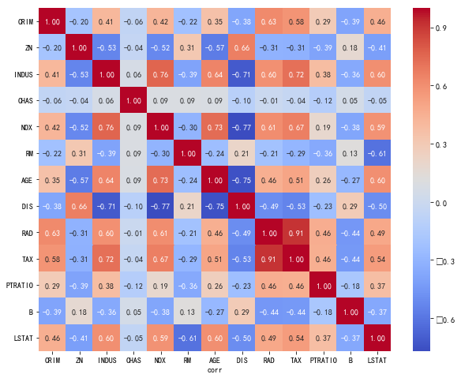
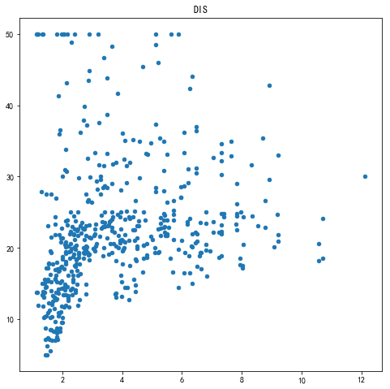
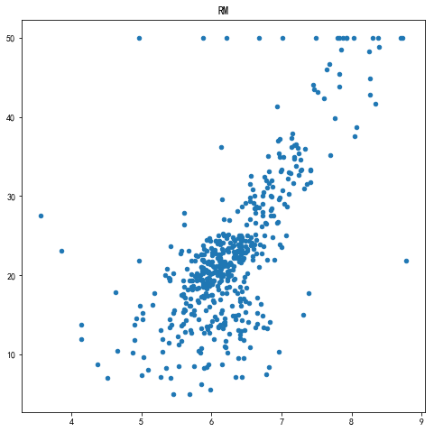
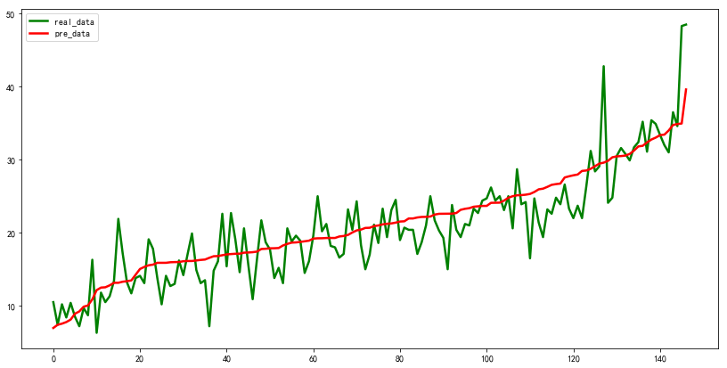
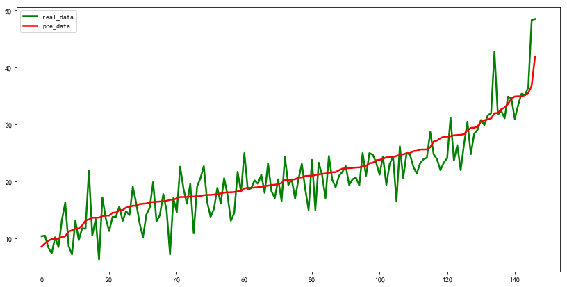

* [线性回归案例学习笔记](https://github.com/sfonly/Machine_Learning/tree/master/Examples/Regression/LinearRegression#线性回归案例学习笔记)
  * [线性回归原理](https://github.com/sfonly/Machine_Learning/tree/master/Examples/Regression/LinearRegression#1-线性回归原理)
  * [HousePrice案例](https://github.com/sfonly/Machine_Learning/tree/master/Examples/Regression/LinearRegression#2-houseprice-案例)
    * [案例背景](https://github.com/sfonly/Machine_Learning/tree/master/Examples/Regression/LinearRegression#21-案例背景)
    * [案例实验](https://github.com/sfonly/Machine_Learning/tree/master/Examples/Regression/LinearRegression#22-案例实验)
      * [数据预处理](https://github.com/sfonly/Machine_Learning/tree/master/Examples/Regression/LinearRegression#221-数据预处理)
      * [特征工程](https://github.com/sfonly/Machine_Learning/tree/master/Examples/Regression/LinearRegression#222-特征工程)
      * [模型训练与评估](https://github.com/sfonly/Machine_Learning/tree/master/Examples/Regression/LinearRegression#223-模型训练与评估)
      * [结果可视化](https://github.com/sfonly/Machine_Learning/tree/master/Examples/Regression/LinearRegression#224-结果可视化)
  * [总结](https://github.com/sfonly/Machine_Learning/tree/master/Examples/Regression/LinearRegression#3-总结)


# 线性回归案例学习笔记
## 1 线性回归原理
**线性回归定义：**  
[线性回归-维基百科](https://zh.wikipedia.org/wiki/线性回归)

在统计学中，线性回归（linear regression）是利用称为线性回归方程的最小二乘函数对一个或多个自变量和因变量之间关系进行建模的一种回归分析。
这种函数是一个或多个称为回归系数的模型参数的线性组合
只有一个自变量的情况称为简单回归，大于一个自变量情况的叫做多元回归

**优点：**  
1. 建模速度快，不需要很复杂的计算，在数据量大的情况下依然运行速度很快  
2. 模型可解释性高，可以根据系数给出每个变量的理解和解释  
3. 模型预测的是连续值
4. 应用广泛，几乎是在所有领域中都需要用到

**缺点：**  
1. 对异常值极为敏感
2. 无法解决非线性问题

## 2 HousePrice 案例
### 2.1 案例背景

波士顿（Boston）是美国马萨诸塞州的首府和最大城市，也是美国东北部的新英格兰地区的最大城市。  
波士顿位于美国东北部大西洋沿岸，创建于1630年，是美国最古老、最有文化价值的城市之一。  
同时，波士顿也是美国房价最高的城市之一。  

假如，你作为一个房屋中介，需要根据房屋的状况设置二手房建议售价。
根据以往的经验，美国房屋的售价和多种因素相关，包括面积、地理位置、环境、房屋建立年限、质量等等。  

  **那么，房屋售价到底和哪些因素相关？相关性有多大，如何衡量？如何准确的给出一个房屋的建议售价？**  

  **房屋中介的述求：**  
  **能不能根据房屋中介前期调研获取的数据，拟合出一个数据模型，输入数据参数后，预测房屋的售价**  


**数据集描述:**

|      |feature_name| feature_type | structure | describe                     |
| ---- | :----:     | :----:       | :----:    | :----:                       |
| 0 | CRIM          | continues    | float     | 区域的平均犯罪率               |
| 1 | ZN            | continues    | float     | 住宅用地超过25000平方英尺的比例 |
| 2 | INDUS         | continues    | float     | 城镇非零售商用土地的比例        |
| 3 | CHAS          | discrete     | int       | 是否接近查理斯河               |
| 4 | NOX           | continues    | float     | 一氧化氮浓度                   |
| 5 | RM            | continues    | float     | 住宅平均房间数                 |
| 6 | AGE_1940      | continues    | float     | 年之前建成的自用房屋比例        |
| 7 | DIS           | continues    | float     | 到波士顿五个中心区域的加权距离   |
| 8 | RAD           | continues    | int       | 辐射性公路的接近指数            |
| 9 | TAX           | continues    | int       | 每10000美元的全值财产税率       |
|10 | PTRATIO       | continues    | float     | 区域师生比                     |
|11 | B             | continues    | float     | 每千人中黑人的占比的相关变量     |
|12 | LSTAT         | continues    | float     | 人口中地位低下者的比例          |
|13 | MEDV          | continues    | float     | 自住房的平均房价                |

**预测值描述:**

MEDV： 自住房的平均房价  

    data.MEDV.describe()
    
    count    506.000000
    mean      22.532806
    std        9.197104
    min        5.000000
    25%       17.025000
    50%       21.200000
    75%       25.000000
    max       50.000000


### 2.2 案例实验

#### 2.2.1 数据预处理
    
**去除空值:**

    print(data.isnull().sum()) # 通过分析可以看出，数据集无缺失值
    
    CRIM       0
    ZN         0
    INDUS      0
    CHAS       0
    NOX        0
    RM         0
    AGE        0
    DIS        0
    RAD        0
    TAX        0
    PTRATIO    0
    B          0
    LSTAT      0
    MEDV       0

#### 2.2.2 特征工程

**特征相关性分析:**

``` python
def show_corr(data):
    plt.figure(figsize=(10,8))
    g = sns.heatmap(data.corr(),annot=True,fmt = '.2f',cmap = 'coolwarm')
    g.set_xlabel('corr')
    plt.show()
```
    可以看出，特征间的相关性较强，其中RAD和TAX的相关性极高，达到了0.91
    这里二者保留其一即可，这里我们保留了TAX特征，去掉RAD特征


**自变量-因变量关联性分析:**

下面，我们列出部分自变量-应变量的关联分析图：

    DIS 和 MEDV



    LSTAT 和 MEDV


    RM 和 MEDV



**去除异常值:**

``` python
i_ = y[y.MEDV == 50].index.tolist()
dropdata(features,y,i_)
```
    可以从前面的散点图看出，很多MEDV=50的点干扰了整体的样本。
    原因是，很多售价超过50的样本也设置为了50，这会对分析最后的零售价造成干扰。
    因此，这里我们选择了直接去除

**数据归一化/标准化:**

    这里的连续特征的分布较大，需要对其进行归一化或标准化处理。
    由于数据集没有表现出明显的高斯分布或均匀分布的情况，这里我对两种方法都进行了尝试。
    
#### 2.2.3 模型训练与评估

    这里使用了线性回归对模型进行训练
    
**归一化后数据模型**

``` python
lr_model coef: [[ -6.95395453   3.24273778  -3.88750597   0.10560699  -6.14608656
                  19.7550797   -1.78413135 -14.66256722  -1.35834977  -8.01915567
                   2.84586617 -11.13945679]]
lr_model intercept:     [26.46737607]
lr_model train_score:     0.7539138730050516
lr_model test_score:      0.7815346895411278
Mean squared error:      12.59
```
    coef 是模型的参数权重矩阵，即为 W
    intercept 是模型的截距，即为 b
    y = wx + b 就是拟合出的模型
    这里的score是指R^2决定系数的得分
    训练集得分为0.75左右
    测试集得分为0.78左右
    最后的平均方差在12.59左右

**标准化后数据模型**

``` python
lr_model coef: [[-6.76494731e+01  9.42741522e+00 -4.86007158e+01  2.23695218e+02
                 -5.47637154e+03  2.50492878e+03 -1.24100827e+01 -5.46324271e+02
                 -7.06826152e+00 -4.30084480e+02  2.47961898e+00 -1.36570173e+02]]
lr_model intercept:     [25.78539007]
lr_model train_score:     0.784251588304244
lr_model test_score:      0.8123073941114468
Mean squared error:      10.82
```
    coef 是模型的参数权重矩阵，即为 W
    intercept 是模型的截距，即为 b
    y = wx + b 就是拟合出的模型
    这里的score是指R^2决定系数的得分
    训练集得分为0.78左右
    测试集得分为0.81左右
    最后的平均方差在10.82左右
    
**模型的效果一般，还有很大的提升空间  
同时应该注意到标准化在这里比归一化效果要好  
后面的模型优化，可以通过加强特征工程，或者将算法改成多项式回归来优化模型**

#### 2.2.4 结果可视化 
    
**归一化后预测值-真实值结果：**


    
**标准化后预测值-真实值结果：**



## 3 总结

    线性回归是一个非常常用的模型，sklearn等基础算法库已经实现得非常好了。  
    如果不是从学习的角度出发，尽量不要去重复造轮子。  
    我们使用的时候，更多的需要去思考特征的涵义和关联。  
